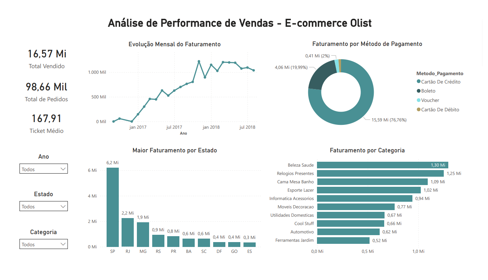
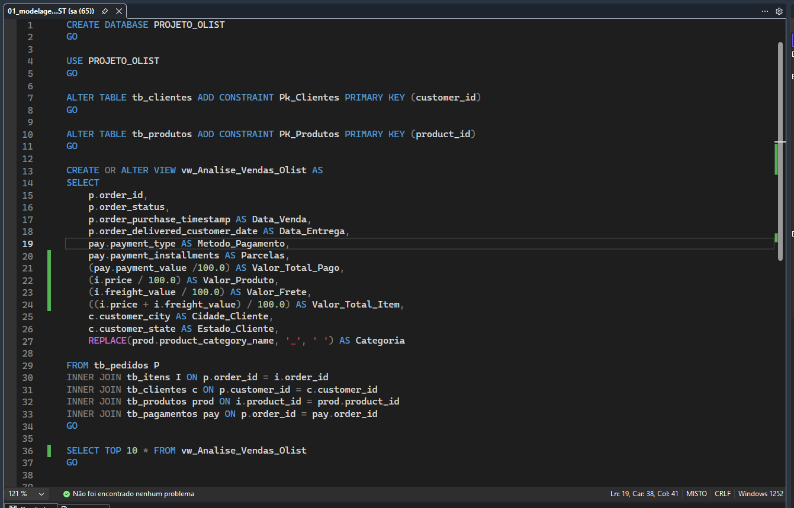
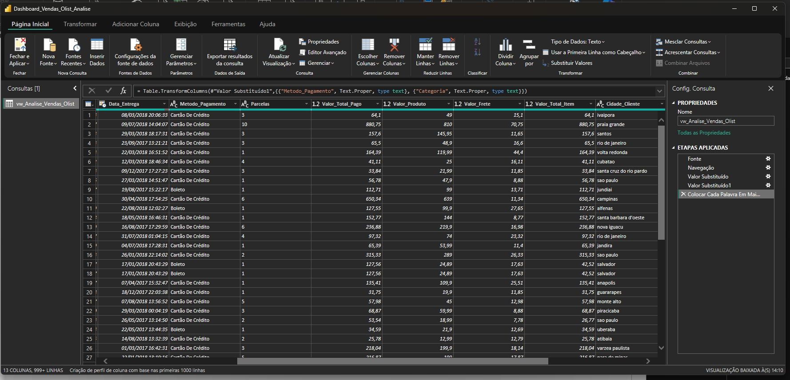
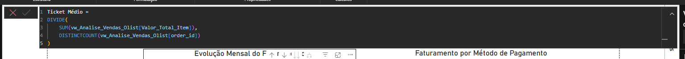

# Análise de Performance de Vendas - E-commerce Olist

## Sobre o Projeto:
Este projeto apresenta uma análise dos dados de e-commerce da Olist (disponíveis no Kaggle). Com objetivo de estruturar um fluxo de dados, partindo de arquivos brutos, passando por modelagem em banco de dados SQL e posteriormente em um dashboard estratégico para tomada de decisões.

## Tecnologias Utilizadas:
* **Banco de Dados:** SQL Server
* **Linguagens:** SQL (Criação de Views, Joins e Chaves Primárias) e DAX (Cálculos de KPIs)
* **Visualização:** Power BI
* **Processamento:** Power Query (ETL e Tradução de dados)

## Fluxo de Desenvolvimento:

### 1. Estruturação no SQL Server
O dataset original foi importado para um banco de dados local. As etapas consequintes incluem:
* Definição de **Primary Keys** para garantir a integridade dos dados no processo.
* Criação de uma **View SQL** unindo as tabelas de Pedidos, Itens, Clientes, Pagamentos e Produtos. Abordagem que otimizou a conexão com o Power BI, enviando apenas os dados necessários (View criada).

### 2. ETL e Tratamento de Dados
No Power Query, foi realizado o tratamento fino para garantir uma interface amigável:
* Tradução de termos técnicos (ex: de "Credit_Card" para "Cartão de Crédito").
* Filtragem de inconsistências temporais (remoção de meses incompletos no final da base de 2018).

### 3. Análise de Dados (DAX)
Criação de uma medida para extração de insights:
* **Ticket Médio:** Valor médio gasto por pedido (R$ 167,91).

## Insights Extraídos:
* **Faturamento:** O projeto totalizou **R$ 16,57 milhões** em vendas.
* **Volume de Vendas:** Mais de **98 mil pedidos** processados.
* **Meios de Pagamento:** O **Cartão de Crédito** foi o método de pagamento, representando **76,76%** da receita, o que sugere uma preferência por parcelamento.
* **Logística:** O estado de **São Paulo (SP)** concentra o maior volume financeiro, com **R$ 6,2 milhões** em faturamento.
* **Categorias:** "Beleza e Saúde" e "Relógios e Presentes" são os nichos mais rentáveis.

## Estrutura do Repositório:
* `/sql_query`: Script SQL da View e modelagem do banco.
* `/dashboard`: Arquivo `.pbix` do Power BI.
* `/images`: Capturas de tela do dashboard, do modelo de dados e do código SQL.

---
**Desenvolvido por: Erick Andrade**
